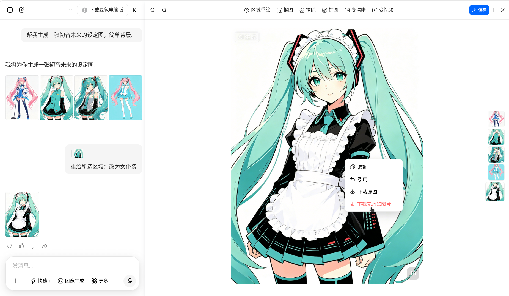

# 豆包无水印图片下载（油猴脚本）

一个为豆包网站添加无水印图片下载功能的用户脚本。无损去除水印。

> [!NOTE]
>
> 时效：2025.8.4 测试有效，后期随时可能失效。
>
> ***安装油猴脚本 👉 [(greasyfork) 豆包无水印图片下载](https://greasyfork.org/en/scripts/544607-%E8%B1%86%E5%8C%85%E6%97%A0%E6%B0%B4%E5%8D%B0%E5%9B%BE%E7%89%87%E4%B8%8B%E8%BD%BD)***

## 特别说明

### 1. 脚本原理

豆包【下载图片】水印在右下角，但【网页图片】水印却在左上角。

- 点击复制的时候会将【下载图片】写到剪贴板里
- 从剪贴板获取【下载图片】
- 把【网页图片】的右下角覆盖到【下载图片】上
- 得到无水印图片

所以这个还是有点局限，如果水印位置修改了，可能就无法使用了。

### 2. 下载的图片错位或不完整

**尽量在生成图片后，马上使用脚本下载**，否则等豆包缓存失效后就无法下载完整图片了。

如果生成的图片比较大，那么生成图片过几分钟或者切换页面再回来，网页图片就会降低分辨率，就无法下载到完整的高分辨率图片了。

## 功能特性

- 🖼️ 在豆包生成的图片右键菜单中添加"下载无水印图片"选项
- 🔄 自动合并处理图片，去除水印
- 💾 一键下载处理后的高质量图片
- 🎯 智能识别图片容器和完整图片源

## 安装方法

1. 安装 [Tampermonkey](https://www.tampermonkey.net/) 浏览器扩展
2. 点击 [安装脚本](https://greasyfork.org/en/scripts/544607-%E8%B1%86%E5%8C%85%E6%97%A0%E6%B0%B4%E5%8D%B0%E5%9B%BE%E7%89%87%E4%B8%8B%E8%BD%BD) 或手动复制脚本代码到 Tampermonkey
3. 确保脚本已启用

## 使用方法

1. 访问 [豆包](https://www.doubao.com/) 网站
2. 生成图片后，右键点击任意生成的图片
3. 在弹出的菜单中选择"下载无水印图片"
4. 等待处理完成，图片将自动下载

## 许可证

GPL-3.0 License

---

⚠️ **免责声明**: 本脚本仅供学习交流使用，请遵守相关网站的使用条款。
